# ProductManager
A simple single page react application with .net core backend to manage one domain entity while sharing changes on the database simultaneously using signalr

##Getting Started to the Back-End
###Asp.net Boilerplate
    This porject is build on asp.net boilerplate project. https://aspnetboilerplate.com/
###.Net Core Backend
    The back-end is build on .net core. And the related solution is under aspnet-core folder.
### Code-first Database Creation
    In order to be able to use the system, an ef-core Update-Database command 
    should be used using the package manager console. 
    
    For the "default project" ProductManager.EntityFrameworkCore should be selected 
    with startup project set as the web host project.
    
    This operation will generate database to your local db. Connection string can be edit 
    within appsettings.json
    
    Database tables should look like below after the operation
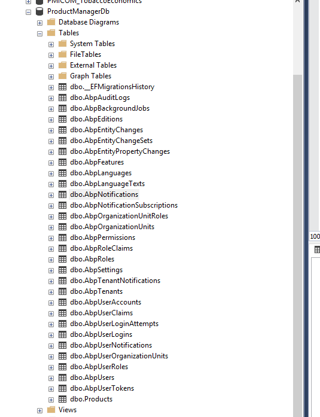
### Swagger
    All back-end api is presented over swagger when the .netcore project is run.
    
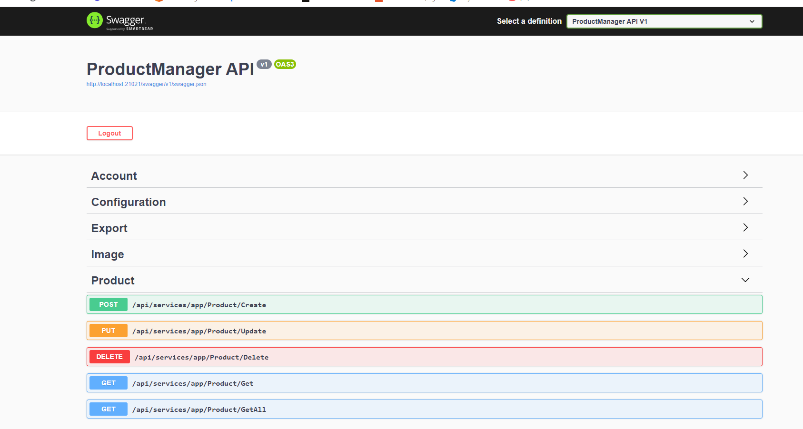
### Login
    You need to login to the system to use it.
    Default user is: 
        username: admin
        password: 123qwe
##Getting Started to the Front-End
    The front-end is build on react. And should be compile using npm.
    
```sh
cd reactjs
npm install 
```

And then start

```
npm start
```
##Endpoint Configuration
    Endpoints should be configured within the project environment variables.
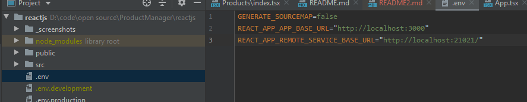 
#Features
##Aspect Oriented Validation
    All validation is managed with aspect oriented approach, so all dto's contains 
    their own validation pattern.
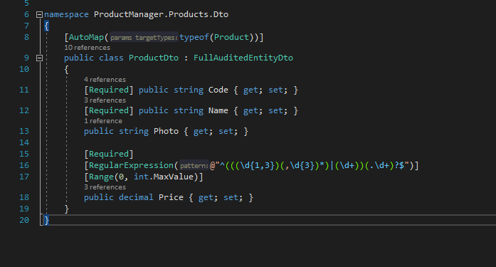    
##Localization
    Localized labels are managed and presented by the back-end. The files are within 
    \aspnet-core\src\ProductManager.Core\Localization\SourceFiles directory. And can be managed 
    for different languages.
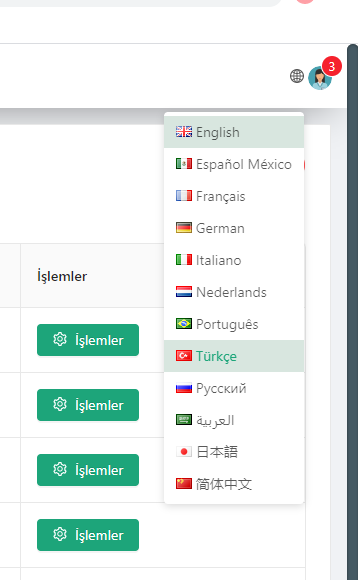
##Unit Tests
    Unit tests are written for the product application service for some business rules.
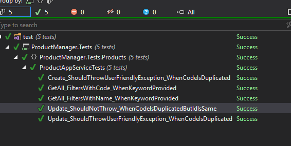
##Excel Export
    All products within product page can be downloaded as excel
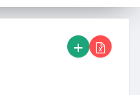
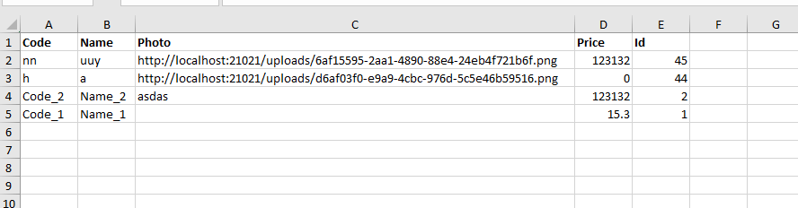
##SignalR Integration
    SignalR is integrated for real time sharing between users. When some product is created/edited/deleted, 
    other users see it in a reasonable time period.
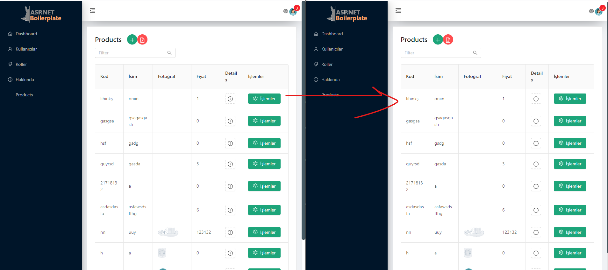
##Photo Upload
    Photo upload is managed with a specific api to upload photos and the reference is saved for the product.
    Each different photo get's uploaded to the public folder and can be accessible within the network.
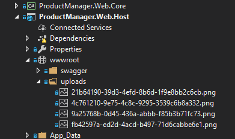
##Background Worker for Not Used Photos
    Photos without any reference from a product is deleted each minute using a background worker.
##Confirmation Box
    A confirmation pop-ups each time a product's price is too high. Confirmation box is localized.
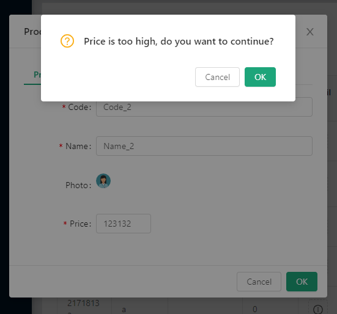
##Details on Products
    Each audit detail is visible(and managable) for the products. Each information get's updated with 
    the related operations. Also, each produt get's deleted softly, database record stays.
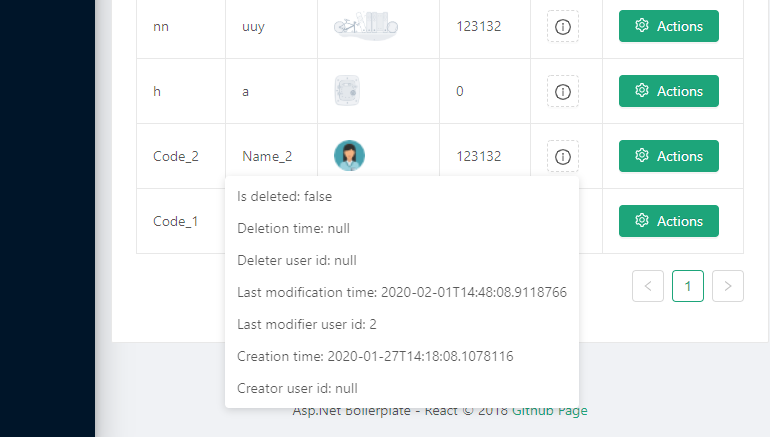
